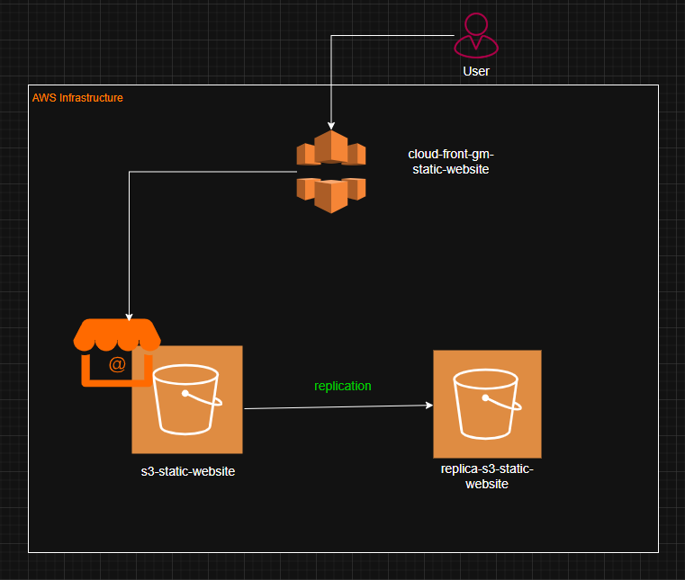
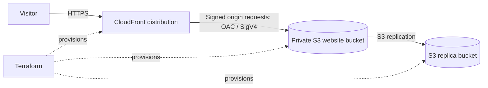
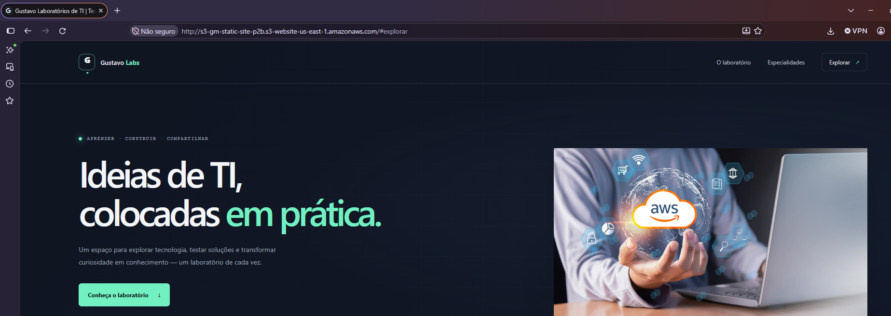
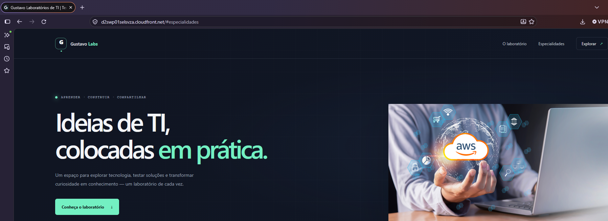
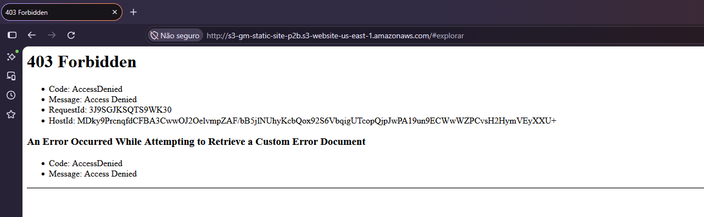
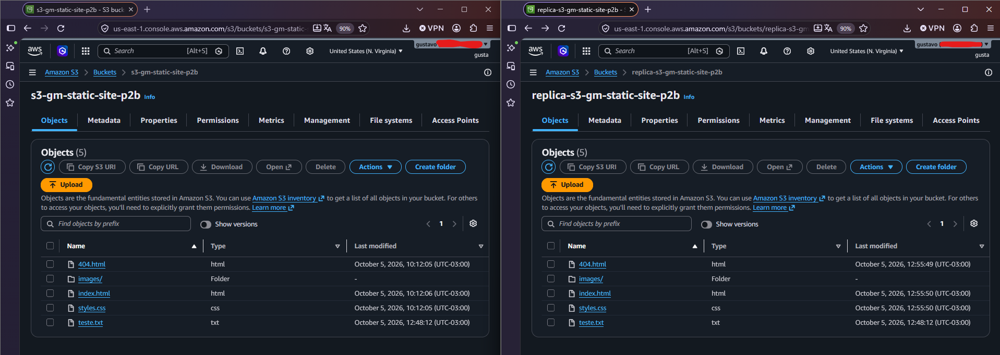

# Static Website on Amazon S3 and CloudFront

Terraform project that provisions a static website on Amazon S3 and serves it through Amazon CloudFront. It also enables S3 replication to a second bucket as a durability and recovery exercise.

## Project difficulty

**Beginner to intermediate.** The project uses core Terraform concepts such as providers, variables, locals, resources, outputs, `for_each`, and resource dependencies. It also brings together AWS identity policies, private S3 access through CloudFront Origin Access Control (OAC), CDN caching, and cross-bucket replication.

## Technologies

| Technology | Purpose |
| --- | --- |
| Terraform `>= 1.6.0` | Infrastructure as code |
| AWS provider `~> 6.0` | Creates and configures AWS resources |
| Random provider `3.9.1` | Adds a short random suffix to S3 bucket names |
| Amazon S3 | Stores the static website and a replicated copy |
| Amazon CloudFront | Distributes website content over HTTPS |
| AWS IAM | Grants S3 the permissions required for replication |
| HTML, CSS, SVG, JPEG | Website pages, styling, icons, and illustrations |
| diagrams.net (draw.io) | Editable architecture diagram |

## Infrastructure Topology


## Architecture



Terraform creates:

1. **Primary S3 bucket** with the static website files, AES-256 server-side encryption, bucket-owner-enforced object ownership, versioning, and all four S3 public-access-block settings enabled.
2. **CloudFront distribution** with IPv6 enabled, `index.html` as its default root object, HTTPS redirection, and a default AWS CloudFront certificate. Its origin is the S3 bucket REST endpoint, protected by an Origin Access Control that signs requests with SigV4.
3. **S3 bucket policy** that grants `s3:GetObject` to the CloudFront service principal only when the request comes from this distribution.
4. **Replica S3 bucket**, also versioned, encrypted, and configured to block public access.
5. **IAM replication role and policy** that allow S3 to read source object versions and replicate them to the destination bucket.
6. **S3 replication configuration** that replicates objects from the primary bucket to the replica bucket.

The S3 website configuration defines `index.html` and `404.html`. However, CloudFront uses the bucket REST endpoint with OAC—not the S3 website endpoint. The intended public entry point is therefore CloudFront; direct access to the S3 website endpoint is not part of this private-origin design.

The replica is **not currently configured as a CloudFront failover origin**. Replication provides a second copy of objects, but serving traffic from that copy during an outage would require additional CloudFront origin/failover configuration and operational testing. S3 replication also does not automatically backfill objects that existed before replication was enabled.

## Repository contents

### Terraform files

| File | Contents |
| --- | --- |
| [`main.tf`](./main.tf) | Random suffix resource used to make bucket names less likely to collide. |
| [`providers.tf`](./providers.tf) | AWS provider configuration; currently sets the region to `us-east-1`. |
| [`versions.tf`](./versions.tf) | Required Terraform version and AWS and Random provider versions. |
| [`variables.tf`](./variables.tf) | `project_name` and `aws_region` input variables and their defaults. Note that the current provider configuration uses a literal region rather than `var.aws_region`. |
| [`locals.tf`](./locals.tf) | Shared resource tags and the CloudFront S3 origin identifier. |
| [`s3_static_website.tf`](./s3_static_website.tf) | Primary and replica buckets, access controls, encryption, website settings, object uploads, versioning, and replication configuration. |
| [`frontdoor.tf`](./frontdoor.tf) | CloudFront Origin Access Control and distribution, including origin, cache behavior, HTTPS redirect, geographic restriction, and viewer certificate settings. |
| [`iamroles.tf`](./iamroles.tf) | IAM role assumed by S3 and the permissions policy used for bucket replication. |
| [`output.tf`](./output.tf) | Outputs for the primary bucket domain, replica bucket domain, and CloudFront domain. |
| [`.terraform.lock.hcl`](./.terraform.lock.hcl) | Provider dependency lock file, including selected provider versions and checksums. |

### Website files

| File | Contents |
| --- | --- |
| [`website/index.html`](./website/index.html) | Portuguese-language landing page for Gustavo Labs. |
| [`website/404.html`](./website/404.html) | Custom not-found page. |
| [`website/styles.css`](./website/styles.css) | Shared styles for the landing and not-found pages. |
| [`website/images/aws-image1.jpg`](./website/images/aws-image1.jpg) | Main landing-page illustration. |
| [`website/images/favicon.svg`](./website/images/favicon.svg) | Website favicon. |
| [`website/images/lab-architecture.svg`](./website/images/lab-architecture.svg) | SVG illustration used as a website asset. |

### Diagrams and test evidence

| Path | Contents |
| --- | --- |
| [`project01-cloud-front-static-website.drawio`](./project01-cloud-front-static-website.drawio) | Editable draw.io diagram of the website, CloudFront, and S3 replication design. |
| [`images/before-cloudfront-s3-static-site.png`](./images/before-cloudfront-s3-static-site.png) | Screenshot evidence from before the CloudFront setup. |
| [`images/cloudfront-s3-static-site.png`](./images/cloudfront-s3-static-site.png) | Screenshot evidence of the site served through CloudFront. |
| [`images/after-cloudfront-s3-static-site-trying-to-access-direct-the-s3-url.png`](./images/after-cloudfront-s3-static-site-trying-to-access-direct-the-s3-url.png) | Screenshot evidence from attempting direct S3 website access after CloudFront access controls were configured. |
| [`images/s3-replication.png`](./images/s3-replication.png) | Screenshot evidence related to S3 replication. |

#### Screenshots

**Before CloudFront**



**Website through CloudFront**



**Attempted direct S3 website access**



**S3 replication**



## Prerequisites

- Terraform `1.6.0` or later.
- AWS credentials configured through the AWS CLI, environment variables, or another supported provider authentication method.
- AWS permissions to create S3 buckets, CloudFront distributions and Origin Access Controls, IAM roles and policies, and S3 replication configuration.

## Deploy

Run these commands from the project directory:

```shell
terraform init
terraform validate
terraform plan
terraform apply
```

After applying, Terraform prints the `cf_url` output. Open that CloudFront domain to visit the site. DNS propagation and CloudFront deployment can take time after initial creation or changes.

To remove the resources when they are no longer needed:

```shell
terraform destroy
```

> **Warning:** Both S3 bucket resources set `force_destroy = true`. Destroying the stack can permanently delete bucket contents, including objects in the replica. Review the plan and preserve any data you need before applying a destroy.

## Potential improvements

- **Add a custom domain with Amazon Route 53.** Create or use a hosted zone, add DNS records (typically an alias record) pointing the domain to CloudFront, and configure the matching domain names on the distribution.
- **Use a custom TLS certificate.** Request or import an ACM certificate for the domain in `us-east-1` (CloudFront requires its ACM viewer certificate to be in that region), validate it, and configure the distribution's `viewer_certificate` block. The current distribution uses the default CloudFront certificate.
- **Connect the replica to a failover design.** Configure a CloudFront origin group with primary and secondary origins and suitable failover criteria, then test recovery. Replication by itself does not fail over viewer traffic.
- **Harden bucket cleanup and recovery.** Consider removing `force_destroy`, using lifecycle protections where appropriate, and documenting how to recover or retain replicated objects.
- **Improve delivery and caching.** Add content-hash-based cache invalidation or versioned asset names, define cache policies deliberately, and automate invalidations as part of a deployment pipeline.
- **Add operational safeguards.** Consider CloudFront access logging, S3 data-event logging where justified, alarms/monitoring, and automated Terraform formatting, validation, and plan review in CI.

