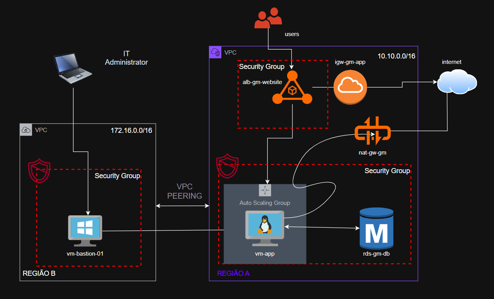
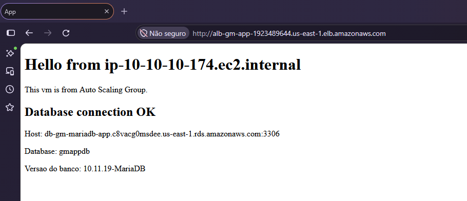
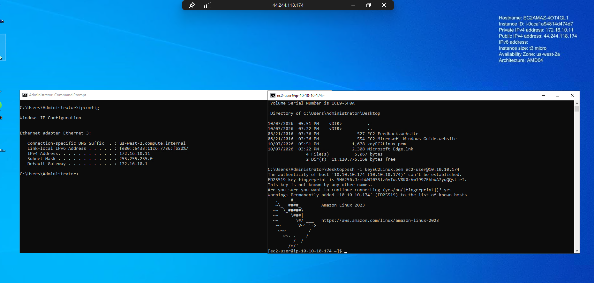
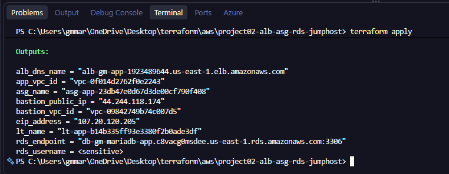

# Multi-Region AWS Web Application with Terraform

This project provisions a small web application environment on AWS using Terraform. It combines a public Application Load Balancer (ALB), private Linux application instances managed by an Auto Scaling Group (ASG), a private MariaDB database, and a Windows bastion host in a second AWS region.

The project demonstrates multi-region provider configuration, cross-region VPC peering, private subnet access, security groups, managed database connectivity, and basic CPU-based scaling.

> **Status:** This is a learning/demo project. Review the security, availability, backup, and cost recommendations near the end before using a similar design in production.

## Difficulty

**Intermediate to advanced (3/5).** The individual AWS components are common, but the project combines multiple Terraform provider aliases and regions, private networking, a cross-region VPC peering connection, an ALB/ASG integration, and RDS connectivity. Troubleshooting region-specific resources and routing requires familiarity with both Terraform and AWS networking.

## Architecture

The application VPC is in **us-east-1 (N. Virginia)**, and the bastion VPC is in **us-west-2 (Oregon)**.



### Application VPC — us-east-1

- **VPC:** CIDR `10.10.0.0/16`.
- **Public subnets:** Two availability zones host the internet-facing ALB. An Internet Gateway provides public connectivity.
- **ALB:** Listens on HTTP port 80 and forwards requests to the application target group.
- **Private application subnets:** The ASG runs Amazon Linux 2023 EC2 instances across two availability zones. Instances do not receive public IP addresses.
- **NAT Gateway:** Allows resources in the application private subnets to initiate outbound internet connections, for example to install packages.
- **Private database subnets:** A DB subnet group places the MariaDB RDS instance in private subnets. The database is not publicly accessible.

### Bastion VPC — us-west-2

- **VPC:** CIDR `172.16.0.0/16`.
- **Public subnet:** Hosts a Windows Server 2022 EC2 bastion instance with a public IP address.
- **Remote administration:** The bastion security group allows RDP on TCP port 3389 from the configured administrator CIDR.

### Cross-region connectivity and request flow

1. Internet clients connect to the public ALB over HTTP.
2. The ALB forwards traffic to healthy application instances in the private subnets.
3. The application instances connect to MariaDB over the VPC-local network.
4. The administrator connects to the Windows bastion. The bastion can reach application instances over SSH through the cross-region VPC peering connection.
5. The NAT Gateway provides outbound internet access to application instances; it is not an inbound path from the internet.

The peering request is created using the `aws.bastion` provider in Oregon and names the app VPC in Virginia as its peer. The `peer_region` argument is required so AWS looks up the peer VPC in `us-east-1`. A separate accepter resource uses the app-region provider to accept the request.

> VPC peering provides private IP connectivity; it does not automatically configure routes or security-group permissions. This project also defines routes and security-group rules for the intended traffic.

## Evidence

The `images/` directory contains the topology and screenshots from the deployment and connectivity tests:

### Application and database

The screenshot shows the web page served through the ALB and a successful database connection.



### Bastion and cross-region access

The screenshot illustrates the Windows bastion connecting to an application instance using SSH over the peered VPCs.



### Terraform outputs

The screenshot records example outputs from a Terraform apply. Public IPs, DNS names, and resource identifiers can change between deployments.



## Technology and design choices

- **Terraform and the AWS provider:** Infrastructure is declared as code and can be reviewed, planned, and reproduced. Provider version constraints are declared in `versions.tf`.
- **Provider aliases:** `aws.app` and `aws.bastion` make the target region explicit for resources in each region.
- **Application Load Balancer:** Provides a stable public entry point and health-check-based routing to the ASG.
- **Auto Scaling Group and Launch Template:** Separate instance configuration from capacity management and place application instances in private subnets. CloudWatch CPU alarms trigger simple scale-out and scale-in policies.
- **Amazon Linux 2023 and PHP/Apache:** The launch template uses the latest matching Amazon Linux 2023 AMI and runs `user_data` to install Apache and PHP and serve a small page that queries MariaDB.
- **Amazon RDS for MariaDB:** Uses a managed database engine in private subnets rather than installing and operating a database on an EC2 instance.
- **NAT Gateway:** Enables outbound access from private application instances without assigning them public IPv4 addresses. A single NAT Gateway keeps this demo simpler but is a production availability and cost trade-off.
- **Windows bastion:** Provides an administrative entry point in a separate VPC and region, illustrating cross-region private access. The application instances also have an IAM instance profile for Systems Manager (SSM).
- **Security groups:** Restrict the intended inbound paths between the ALB, application instances, database, and bastion.

## Repository file guide

| File | Purpose |
|---|---|
| `versions.tf` | Terraform and provider version constraints. |
| `provider.tf` | AWS provider aliases and region configuration for the app and bastion VPCs. |
| `variables.tf` | Network, availability-zone, administrator CIDR, and database input variables. |
| `locals.tf` | Common tags applied to selected resources. |
| `vpc.tf` | Both VPCs, their subnets, and Internet Gateways. |
| `routetables.tf` | Route tables and subnet associations, plus routes across the VPC peering connection. |
| `peering.tf` | Cross-region VPC peering request and accepter. |
| `security_groups.tf` | Inbound and outbound rules for the ALB, application instances, RDS, and bastion. |
| `nat_gw.tf` | NAT Gateway and its Elastic IP in the app VPC. |
| `alb.tf` | Application target group, internet-facing ALB, and HTTP listener. |
| `launch_template.tf` | App EC2 launch template, AMI and key-pair lookups, instance profile, and rendered startup script. |
| `auto_scaling.tf` | Application ASG, target group attachment, and CPU-based CloudWatch scaling alarms and policies. |
| `rds.tf` | MariaDB RDS instance and its DB subnet group. |
| `bastion_windows.tf` | Windows Server AMI lookup and bastion EC2 instance. |
| `iam_ssm.tf` | EC2 role, managed policy attachment, and instance profile for Systems Manager access. |
| `output.tf` | Useful deployment outputs, including ALB DNS name, database endpoint, and VPC IDs. |
| `templates/user_data.sh.tpl` | Shell/PHP startup template used to configure the application instance. |
| `images/` | Architecture diagram and deployment/connectivity screenshots. |

## Prerequisites

- An AWS account and credentials configured for Terraform, with permissions to create the listed services in both regions.
- Terraform `>= 1.6.0`.
- Existing EC2 key pairs named `keyEC2Linux` in `us-east-1` and `keyEC2Windows_Oregon` in `us-west-2`, or corresponding updates to the key-pair references in the configuration.
- An administrator public CIDR in `/32` format for the bastion RDP rule.
- Values for the required `allowed_admin_cidr`, `db_user`, and `db_pwd` Terraform variables.

## Deploy

Set the required variables using a protected local `terraform.tfvars` file or your approved secret-delivery process. For example:

```hcl
allowed_admin_cidr = "203.0.113.10/32"
db_user            = "appadmin"
db_pwd             = "replace-with-a-strong-secret"
```

Do not use the example values above as real credentials. Do not commit `terraform.tfvars`, Terraform state, plan files, or credentials. Marking an output or variable `sensitive` only redacts some CLI output; it does not encrypt or remove the value from Terraform state.

From the project directory, run:

```sh
terraform init
terraform fmt -check
terraform validate
terraform plan
terraform apply
```

Review the plan before applying. Terraform creates billable resources, including a NAT Gateway, load balancer, EC2 instances, and RDS. When the environment is no longer needed, review the plan and remove it with:

```sh
terraform destroy
```

The current database configuration skips the final snapshot, so destroying the database can permanently delete its data.

## Recommended improvements

### Add HTTPS and a custom domain

1. Register or delegate a domain to a Route 53 hosted zone.
2. Request an AWS Certificate Manager (ACM) certificate in **us-east-1**, the ALB's region, and complete DNS validation.
3. Add an HTTPS listener on port 443 to the ALB using the ACM certificate, and redirect HTTP port 80 requests to HTTPS.
4. Restrict the ALB security group to the required public ports. HTTPS is not configured yet.
5. Add a Route 53 alias record pointing the application hostname to the ALB.

### Improve secret handling

- Avoid placing the database password in EC2 `user_data` and the Launch Template. User data can be retrievable from instance metadata or control-plane interfaces, and the rendered configuration can also persist in Terraform state.
- Store the database credential in AWS Secrets Manager or Systems Manager Parameter Store, grant the app instance role permission to read only that secret, and retrieve it at runtime.
- Use a remote Terraform backend with encryption, access controls, and state locking. Keep local state and plan artifacts out of source control, and rotate credentials if they may have been exposed.

### Tighten network access

- Consider restricting application-instance egress instead of allowing all outbound traffic, while retaining only the destinations and ports the application requires.
- Prefer AWS Systems Manager Session Manager for administrative access where feasible. It can reduce exposure of RDP/SSH and avoid relying on a public bastion IP; ensure the required SSM connectivity is available.
- Validate that the bastion administrator CIDR is a trusted, current `/32` and avoid exposing RDP broadly.

### Improve resilience and operations

- Add a NAT Gateway per Availability Zone and route each private subnet through its local NAT Gateway for higher availability. This increases cost.
- Enable RDS automated backups and configure a final snapshot/retention policy appropriate to the data's recovery requirements.
- Consider Multi-AZ RDS for higher availability and encryption at rest for the database and EC2 volumes.
- Pin a tested Launch Template version in the ASG rather than always using `$Latest` when promoting production changes.
- Add monitoring, application and ALB access logs, alarms for availability and database health, and a documented recovery process.
- Review instance sizes, storage types, scaling thresholds, and deletion protection for the intended workload and budget.

## Security note

This configuration has useful foundations for a demo: the application instances and database are private, the RDS instance is not publicly accessible, the app security group accepts web traffic from the ALB security group, and RDP is limited to a configurable administrator CIDR. However, it is **not production-ready** without addressing the secret exposure path, overly broad database port range, HTTP-only ALB listener, disabled database backups, and availability trade-offs described above.
