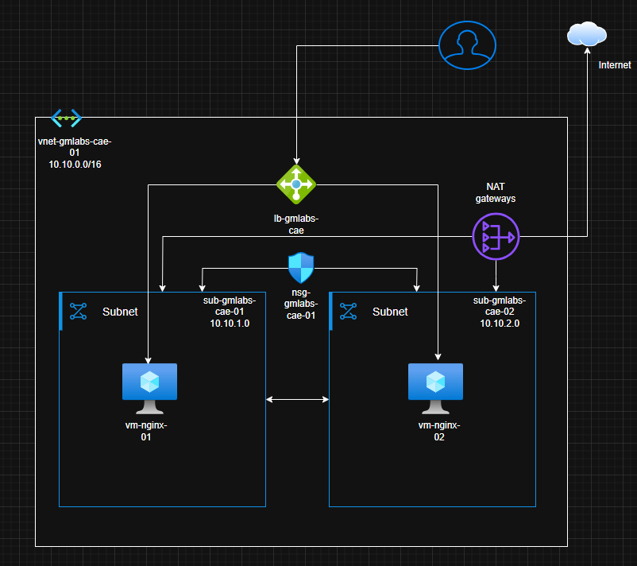

# Azure HTTP Load Balancer Lab

An educational Terraform project that provisions a small HTTP web environment on Microsoft Azure. It runs two Linux virtual machines with Nginx behind a public Azure Load Balancer.

> **Lab project, not production-ready.** This project was created to learn Terraform and Azure infrastructure. It intentionally keeps the application and infrastructure simple, and it has known security and operational limitations documented below.

## Project Goals

- Provision the complete infrastructure with Terraform.
- Run the same Nginx web server on two Linux virtual machines.
- Expose the web application through a public Azure Load Balancer.
- Separate the virtual machines into two subnets and provide outbound connectivity through a NAT Gateway.
- Practice Terraform resource references, variables, locals, outputs, provider configuration, a registry module, and cloud-init.

## 📐 Architecture / Topology

Below is a diagram of the architecture deployed in this project:



## Architecture

The deployment is created in the `canadaeast` region and contains:

- One resource group and one virtual network (`10.10.0.0/16`).
- Two subnets (`10.10.1.0/24` and `10.10.2.0/24`), with one Linux VM in each.
- One network security group associated with both subnets. It allows inbound TCP traffic on port 80.
- Two network interfaces, one for each VM.
- Two Ubuntu 24.04 VMs running Nginx, configured with cloud-init.
- One Standard public IP and one Standard public Load Balancer with a backend pool, an HTTP health probe, and a TCP forwarding rule on port 80.
- One NAT Gateway and a separate public IP for outbound connectivity from both subnets.

The VM network interfaces are attached to the Load Balancer backend pool. The Load Balancer probe checks HTTP on port 80 and routes incoming web traffic to healthy backends. The NAT Gateway handles outbound connectivity; it does not provide inbound access to the VMs.

See the [architecture diagram](p1-lb-2vmServer-http.drawio).

## Technologies and Why They Are Used

| Technology | Purpose in this project |
| --- | --- |
| Terraform | Defines and provisions the infrastructure as code, allowing it to be planned, applied, and destroyed consistently. |
| AzureRM provider | Manages Azure resources such as virtual networks, VMs, public IPs, NAT Gateway, and Load Balancer. |
| Azure Naming module | Reuses the `Azure/naming/azurerm` module to generate Azure resource names. |
| Random provider | Declared alongside AzureRM and used by the configuration/module dependency for generated values. |
| Azure Virtual Network and subnets | Provide private network address space and separate the two VM network interfaces. |
| Network Security Group (NSG) | Controls inbound traffic at the subnet level; this lab allows HTTP on port 80. |
| Azure Load Balancer | Publishes a stable frontend IP and distributes TCP traffic across the VM backend pool. |
| Health probe | Checks whether an Nginx backend responds over HTTP before the Load Balancer sends it traffic. |
| NAT Gateway | Provides outbound internet connectivity to the private subnets without assigning public IPs to the VMs. |
| Ubuntu and Nginx | Provide the Linux web servers used to demonstrate the load-balanced HTTP endpoint. |
| cloud-init | Installs and starts Nginx when each VM is provisioned, then writes a page containing the VM hostname. |

## Repository Layout

| File | Responsibility |
| --- | --- |
| `versions.tf` | Terraform and provider requirements. |
| `provider.tf` | AzureRM provider configuration. |
| `main.tf` | Azure Naming module declaration. |
| `resourcegroup.tf` | Resource group. |
| `network.tf` | NSG, VNet, subnets, public IP for NAT, and NAT Gateway associations. |
| `compute.tf` | Network interfaces and Linux virtual machines. |
| `load_balancer.tf` | Load Balancer, frontend public IP, backend pool, probe, rule, and VM associations. |
| `variables.tf` | Project naming input. |
| `locals.tf` | Shared tags. |
| `output.tf` | Public and private IP outputs. |
| `cloud-init.yaml` | Nginx installation and sample page setup. |
| `p1-lb-2vmServer-http.drawio` | Architecture diagram source. |

Terraform loads all `.tf` files in the root module together; the file names group resources for readability and do not determine creation order.

## Prerequisites

- An Azure free account subscription with permission to create the resources in this project.
- Terraform installed.
- Azure CLI installed and authenticated, or another supported AzureRM authentication method configured outside this repository.

For local interactive use, authenticate with the Azure CLI before running Terraform:

```shell
az login
```

Do not add Azure credentials, service principal secrets, private keys, or Terraform state files to this repository. A private GitHub repository is still not a secret store.

## Deploy the Lab

Run these commands from the project root:

```shell
terraform init
terraform validate
terraform plan
terraform apply
```

After deployment, retrieve the Load Balancer public IP:

```shell
terraform output -raw lb_public_ip
```

Open `http://<load-balancer-public-ip>` in a browser. The page should identify the VM that handled the request. Repeated requests may reach different healthy backends.

## Security Notes and Improvements

This is a learning lab, and the current configuration is not a security template for production:

- The VM administrator username and password are defined directly in `compute.tf`. The Terraform state also contains the password in clear text. The state file and its backup must not be committed or shared. If a real or reused credential has ever been published, rotate it.
- Password authentication is enabled on the Linux VMs. For a safer version, use `azurerm_linux_virtual_machine` with an SSH public key and disable password authentication. Keep the private key outside the repository. Do not add an inbound SSH rule unless there is a deliberate, restricted administrative access design.
- Terraform's `sensitive` variable marking can hide a value from normal CLI output, but it does not by itself keep that value out of state. Protect state with a remote backend that has encryption, access controls, and state locking; restrict who can read it.
- The web endpoint uses plain HTTP. Add HTTPS and certificate management if the goal becomes a realistic public-facing service.
- The NSG allows HTTP from any source because the demo endpoint is public. Review and narrow network rules for any non-demo use.
- Use a managed identity or federated identity for automation where appropriate, rather than storing long-lived Azure credentials in code or CI configuration.
- Configure resource tags, budget alerts, and cleanup reminders. VMs, disks, public IPs, Load Balancer, and NAT Gateway can incur charges while deployed.

The absence of an inbound SSH rule and public IPs on the VMs limits direct management access in this lab, but it does not make hard-coded credentials safe to publish or reuse.

## Current Scope and Possible Improvements

The current implementation is intentionally small and uses fixed values for the region, VM size, network ranges, and several resource names. Possible next improvements include:

- Add validated input variables for region, VM size, address ranges, and naming values.
- Replace the older general-purpose `azurerm_virtual_machine` resources with `azurerm_linux_virtual_machine`; plan any state migration carefully to avoid unintended VM replacement.
- Reduce duplicated VM and NIC configuration with `for_each` after the explicit two-VM version is well understood.
- Add a secured remote Terraform backend and document the backend bootstrap process separately.
- Add availability zones or a VM Scale Set with autoscaling to explore resilience and scaling beyond two fixed VMs.
- Add HTTPS, monitoring, diagnostic settings, and a repeatable smoke test for the Load Balancer endpoint.
- Add CI validation such as `terraform fmt -check`, `terraform validate`, and a security scanner, without automatically applying infrastructure from untrusted changes.

## Difficulty

**Estimated level: Intermediate (foundational).** The project combines compute, networking, security rules, outbound networking, a health-checked Load Balancer, and cloud-init, with dependencies between multiple Azure resources. The application itself is intentionally simple, and the project does not yet include reusable custom modules, remote state, automated tests, CI/CD, or production-grade security and availability controls.

## Destroy the Lab

When finished, remove the resources to avoid ongoing charges:

```shell
terraform destroy
```

Confirm that the resources are no longer needed before approving the destroy operation. Keep any state required for future management in a secure location; do not commit it to Git.