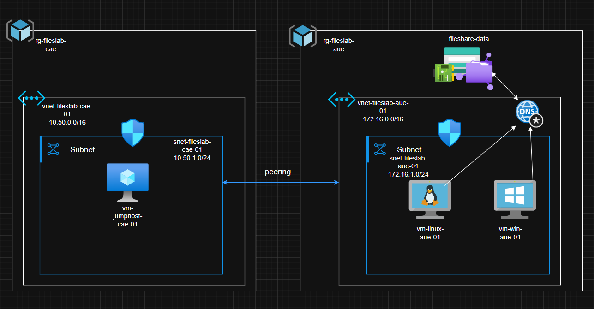
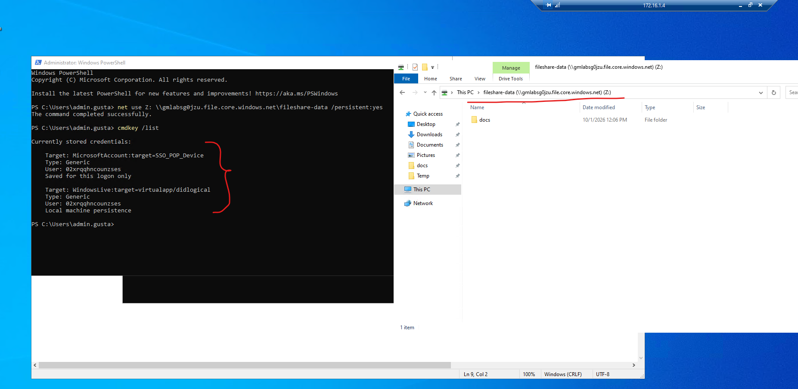
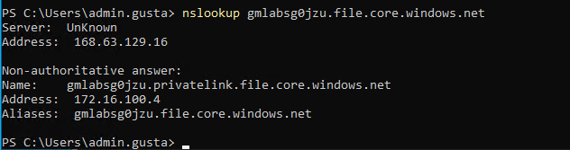
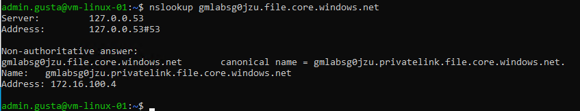
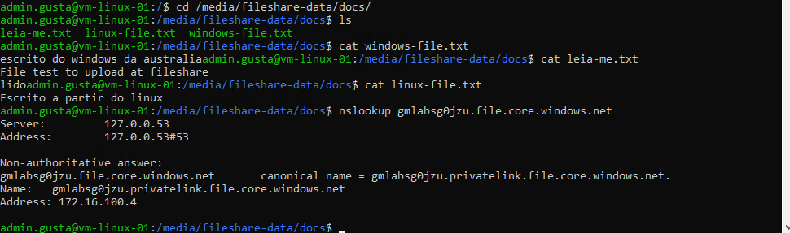

# Azure Files Share Across Windows and Linux VMs

A Terraform learning project that deploys an Azure Files share in Australia East and a small multi-region VM environment to explore private connectivity, virtual network peering, and managed-identity-based SMB authorization.

> **Lab scope:** The goal is to practice Azure infrastructure and identity configuration with Terraform. The Windows share mapping was tested manually using the VM's system-assigned managed identity and RBAC. The Linux VM was intentionally left without Azure Files authentication by RBAC, but in both VMs in Australia, we tested the connection manually; you can see some tests in the images folder. The main goal was to create the infrastructure at Azure by terraform testing file share with a Windows and Linux OS and not create scripts in bash or Powershell




## Architecture

- Two resource groups: workload resources in Australia East and a jump host in Canada East.
- Two virtual networks connected by bidirectional VNet peering.
- A Canada jump-host Windows VM (acting at this lab as bastion) with a static public IP. Its NSG allows RDP only from the administrator CIDR supplied to Terraform.
- An Australia workload VNet with a Windows VM and an Ubuntu Linux VM using private IP addresses.
- The workload NSG allows RDP and SSH only from the Canada jump-host subnet, rather than from the public internet.
- An Azure Storage Account (StorageV2, Standard/LRS) with an Azure Files share and a 10 GiB quota.
- Storage public network access just from specific network as my home IP; access to the `file` subresource is provided through a private endpoint and the `privatelink.file.core.windows.net` private DNS zone.
- SMB OAuth enabled on the Storage Account using AzAPI.
- A system-assigned managed identity on the Australia Windows VM, granted the `Storage File Data SMB Share Contributor` role at Storage Account scope.
- Terraform-managed tags, generated Storage Account name suffix, and output values for VM private IPs, the jump-host public IP, and Storage Account name.

The Linux VM is intentionally left without a configured Azure Files mount or a Storage Account role assignment. It is a starting point for implementing and comparing another Terraform-managed access and mount approach.

## Technologies

- Terraform
- Microsoft Azure
- AzureRM provider (`5.7.0`)
- AzAPI provider (`2.13.0`)
- Random provider (`3.9.1`)
- Azure Virtual Network, subnet, NSG, public IP, NIC, and VNet peering
- Azure Windows Server 2022 and Ubuntu 24.04 virtual machines
- Azure Storage Account, Azure Files, private endpoint, and private DNS
- Microsoft Entra ID managed identity and Azure RBAC
- PowerShell via the Azure Custom Script Extension

## Challenges and Learning Outcomes

- Connecting VNets in different Azure regions and controlling traffic with NSGs.
- Keeping Azure Files off the public network while resolving its service name through private DNS.
- Enabling SMB OAuth with AzAPI when the required Storage Account property is not configured through the AzureRM resource in this implementation.
- Assigning a VM's system-assigned identity an Azure Files role through Terraform, while deliberately keeping guest-OS mount automation out of scope.
- Reusing a `for_each` map to define Windows VMs with different roles and locations.
- Handling Azure naming constraints, Storage Account name uniqueness, and region-specific resource placement.
- Supplying sensitive VM credentials and an SSH public key through Terraform variables.

## Difficulty

**Intermediate (learning project).** The individual resources are approachable, but the project combines network segmentation, cross-region peering, private DNS, private endpoints, guest OS access, and identity-based authorization. It is a good step beyond deploying a single VM or storage account, while still being small enough to understand resource dependencies in Terraform.

## Prerequisites

- Terraform installed.
- An Azure subscription and an authenticated Azure CLI session (for example, `az login`).
- Permissions to create the listed Azure resources and role assignments.
- A Linux SSH public key file available on the machine running Terraform.
- An administrator public IP in CIDR notation, typically `/32`, for the jump-host RDP rule.

## Configuration and Deployment

Provide values for the required Terraform variables. The Windows password input is marked `sensitive = true` in `variables.tf`; do not commit real credentials or local variable files to a public repository.

```hcl
# Example terraform.tfvars (use your own values; do not commit this file)
admin_username            = "your-admin-user"
windows_admin_password    = "replace-with-a-strong-secret"
linux_ssh_public_key_path = "C:/path/to/id_rsa.pub"
allowed_admin_cidr        = "x.x.x.x/32"
terraform_runner_public_ip = "x.x.x.x" without /32
```

Initialize and validate the configuration, then inspect the plan before applying:

```sh
terraform init
terraform validate
terraform plan
terraform apply
```

Destroy the lab when it is no longer needed to avoid ongoing Azure charges:

```sh
terraform destroy
```

## Future Improvements

- As an optional follow-up focused on guest-OS automation, add PowerShell and Bash scripts to verify DNS and TCP port 445 and mount the share. Keep this separate from the current Terraform-focused lab objective.
- As a separate learning exercise, configure and compare a Linux Azure Files authentication and mount workflow. Linux access is intentionally not configured in this project.
- Make scripts idempotent, avoid logging secrets, and report clear success or failure through VM extensions or cloud-init.


## Security Notes

- The Storage Account has public network access Enable just from my home IP (cause if I totally dissabled I won´t be able to run plan or apply from my machine, I will need to upload the script to a machine that has access to the private IP from the SA and deploy from there, in a production environment it is okay to do it, but in a lab it is not necessary), and the share is reached over a private endpoint. Network and DNS connectivity must be available from each client VNet that needs access.
- The jump host has a public IP, but its NSG allows RDP only from `allowed_admin_cidr`. The workload NSG allows RDP/SSH only from the jump-host subnet. Keep these source ranges narrow and avoid broad public ranges such as `0.0.0.0/0`.
- The Windows VM role assignment uses `Storage File Data SMB Share Contributor`, which allows read, write, and delete operations, at Storage Account scope. 
- Mark secret inputs as `sensitive = true` and supply them securely. This hides values in normal CLI output but does not remove them from Terraform state.

## Project Layout

| File | Purpose |
| --- | --- |
| `main.tf` | Naming module and random Storage Account suffix |
| `rg.tf` | Regional resource groups |
| `network.tf` | VNets, subnets, NSGs, public IP, and VNet peering |
| `vm_windows.tf` | Windows VMs, NICs, and the Windows Files connectivity check |
| `vm_linux.tf` | Linux VM and NIC |
| `storage_fileshare.tf` | Storage Account, Azure Files share, SMB OAuth, and Windows identity role assignment |
| `private_endpoint.tf` | Private endpoint and private DNS zone/link |
| `variables.tf`, `locals.tf`, `provider.tf`, `versions.tf` | Inputs, shared values, provider, and version constraints |
| `output.tf` | Deployment output values |

## Diagram

Project network and file-share diagram: [`p2-fileshare-between-win-linux-and-jumphost.drawio`](p2-fileshare-between-win-linux-and-jumphost.drawio).

## Test Evidence

The `images/` folder contains screenshots from manual tests. They document the Windows share mapping through the system-assigned identity and `nslookup` results for the Azure Files hostname, showing private DNS resolution to the private endpoint from the Windows and Linux test VMs. These are manual test records, not automated Terraform tests.

### Windows





### Linux DNS Check




