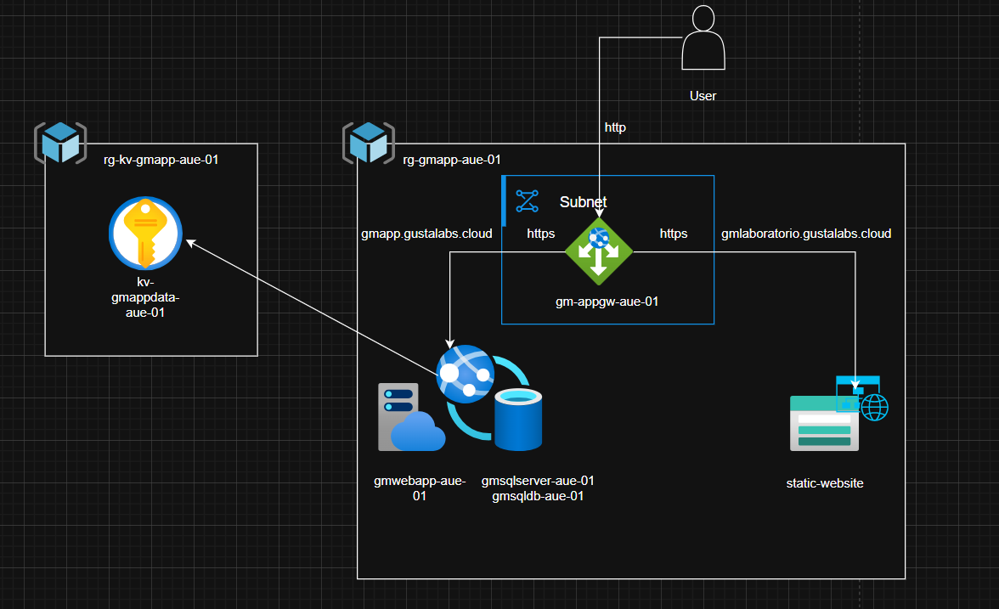
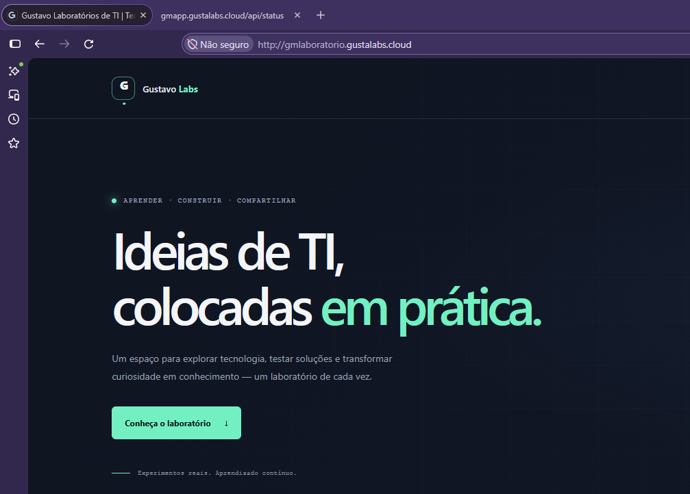
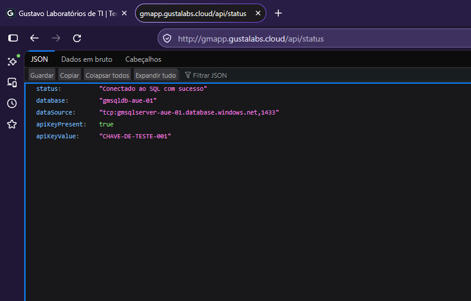
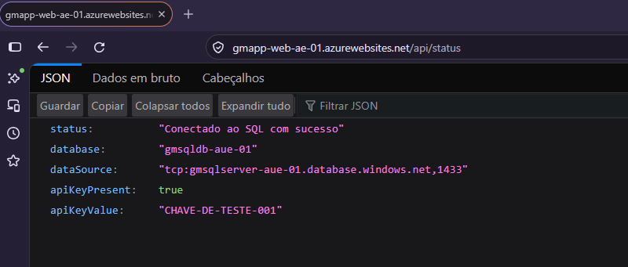

# Project 03 — IT Lab on Azure

Infrastructure as code for an IT lab combining a .NET application, Azure SQL, Key Vault, and a static website. Azure Application Gateway publishes the application and the static site on separate hostnames and routes requests to their respective backends.

> **Difficulty: Intermediate to advanced (4/5).** This project combines Terraform, networking, hostname-based routing, Application Gateway, managed identity, RBAC, Key Vault, SQL, and application deployment. It is intended for learning and demonstration; the current configuration still needs improvements before it can be considered production-ready.

## Architecture



```text
Browser
  │
  ├─ gmapp.gustalabs.cloud ──────────────────┐
  └─ gmlaboratorio.gustalabs.cloud ──────────┤
       Locally resolved with the Windows hosts file
                                               ▼
                                  Static public IP address
                                  Azure Application Gateway
                                  HTTP listeners on port 80
                                     │                  │
                                  HTTPS / 443        HTTPS / 443
                                     │                  │
                                     ▼                  ▼
                              Linux App Service   Azure Storage
                              .NET 8 application  Static website
                                     │
                         Managed identity / Microsoft Entra ID
                                  ┌──┴──┐
                                  ▼     ▼
                            Azure SQL  Key Vault
```

Application Gateway selects the backend based on the incoming `Host` header:

| Browser address | Destination |
| --- | --- |
| `http://gmapp.gustalabs.cloud` | .NET Web App on Azure App Service |
| `http://gmlaboratorio.gustalabs.cloud` | Static website hosted on Azure Storage |

Both hostnames resolve to the same Application Gateway public IP. **The client connects to the gateway over HTTP on port 80.** From the gateway to both the App Service and Storage, the backend settings and health probes use HTTPS on port 443. Therefore, traffic between a browser and the gateway is not encrypted, even though the gateway uses HTTPS to its backends.

### Resolving the hostnames locally on Windows

This project does not configure public DNS for these hostnames. For local testing, the hostnames were mapped to the Application Gateway IP address in the Windows `hosts` file. Get the IP address created by Terraform:

```powershell
terraform output -raw app-gw-ipp
```

Open Notepad as an administrator and edit:

```text
C:\Windows\System32\drivers\etc\hosts
```

Add a line with the returned IP address and both hostnames:

```text
<APPLICATION-GATEWAY-PUBLIC-IP> gmapp.gustalabs.cloud gmlaboratorio.gustalabs.cloud
```

Save the file and, if needed, flush the DNS cache:

```powershell
ipconfig /flushdns
```

This change applies only to the computer whose `hosts` file was edited. It does not register the domain names on the public Internet or make them publicly resolvable for other users.

## Technologies and services

| Technology/service | How it is used |
| --- | --- |
| **Terraform** | Declaratively provisions and updates the infrastructure. |
| **AzureRM Provider 5.7.0** | Manages Azure resources; the version is pinned in `versions.tf` and recorded in the provider lock file. |
| **Random Provider** | Generates a suffix for the globally unique Storage account name. |
| **Azure Resource Groups** | Separate the Key Vault resources from the main application resources. |
| **Azure Virtual Network and subnet** | Provide the virtual network and subnet dedicated to Application Gateway. |
| **Azure Standard static public IP** | Provides the Application Gateway frontend address. |
| **Azure Application Gateway Standard_v2** | Routes requests by hostname to the Web App or static website. Its configured capacity is one instance. |
| **Azure App Service for Linux** | Hosts the ASP.NET Core application on the Free F1 plan. |
| **.NET 8 / ASP.NET Core** | Implements the web application and its SQL connectivity status endpoint. |
| **Microsoft.Data.SqlClient 7.1.1 and Azure authentication extension 7.1.1** | Connect to Azure SQL using Microsoft Entra authentication. |
| **Azure SQL Database serverless** | General Purpose, Gen5 database configured with a 0.5 vCore minimum, a 60-minute auto-pause delay, and a 2 GB maximum size. |
| **Azure Key Vault** | Stores a demonstration secret that App Service retrieves through a Key Vault reference. |
| **System-assigned managed identity and RBAC** | Grant the Web App identity read access to Key Vault secrets. SQL access also requires a database user and appropriate database permissions. |
| **Azure StorageV2 Static Website** | Hosts HTML, CSS, and SVG assets in the `$web` container, with index and 404 documents configured. |
| **HTML, CSS, and SVG** | Implement the responsive static website and its local illustrations without a frontend build step. |
| **Microsoft Entra ID** | Provides the administrative identity and passwordless authentication configured for the application's SQL connection. |
| **PowerShell and Azure CLI** | Package and deploy the Web App ZIP and configure local testing. |
| **draw.io** | The editable architecture diagram is currently outdated and is awaiting an update. The screenshots in `imagens/` are deployment evidence, not a replacement for the updated architecture diagram. |

## Terraform file reference

Terraform files are located in the project root and are grouped primarily by service:

| File | Purpose |
| --- | --- |
| `versions.tf` | Pins the AzureRM and Random provider versions. |
| `provider.tf` | Configures the AzureRM provider and the recovery/purge behavior for deleted Key Vaults. |
| `main.tf` | Declares the Azure Naming module and the random string used in the Storage account name. |
| `variables.tf` | Defines project name, location, network CIDRs, and SQL/identity inputs. |
| `locals.tf` | Centralizes common tags and helper names for Application Gateway. |
| `rg.tf` | Creates the workload and Key Vault resource groups. |
| `network.tf` | Creates the Virtual Network and Application Gateway subnet. |
| `appgw.tf` | Creates the public IP and Application Gateway, including hostname-based HTTP listeners, HTTPS backends, health probes, and routing rules. |
| `appserviceplan.tf` | Creates the Linux F1 App Service plan. |
| `webapp.tf` | Configures the .NET 8 Web App, managed identity, SQL connection settings, and Key Vault secret reference. |
| `sql.tf` | Creates the Azure SQL server and serverless database, along with firewall rules. |
| `key_vault.tf` | Creates the RBAC-enabled Key Vault, role assignments, and demonstration secret. |
| `sa_static_website.tf` | Creates the StorageV2 account, configures Static Website hosting, and uploads files from `website/` to `$web`. |
| `output.tf` | Exposes the Key Vault URI, Storage account name, and Application Gateway public IP. `static-website-name` is the **account name**, not the website URL. |
| `.terraform.lock.hcl` | Records provider selections and checksums generated by `terraform init`. |

## Provision the infrastructure

### Prerequisites

- Terraform.
- Azure CLI, signed in with an identity authorized to create the resources and required RBAC assignments.
- Valid values for the required variables, including the SQL administrator credentials and the public IP address allowed by the SQL firewall.
- .NET 8 SDK to build and publish the Web App.

Run these commands from the directory containing this README:

```powershell
terraform init
terraform validate
terraform plan
terraform apply
```

The local `terraform.tfvars` file supplies required variable values. Terraform's `sensitive = true` setting only reduces values shown in command output; **it does not encrypt the state file**.

After provisioning, retrieve the Application Gateway frontend IP:

```powershell
terraform output -raw app-gw-ipp
```

The `static-website-name` output returns the Storage account name. Users reach the static site through the hostname configured on Application Gateway, resolved locally with the Windows `hosts` file as described above.

## .NET application: prepare, package, and deploy

The project used by these instructions is in `app/GmAppSqlDemo/`. The ASP.NET Core 8 application maps `GET /` to a redirect to `GET /api/status`. The status endpoint attempts to open an Azure SQL connection and reports whether the Key Vault-backed setting is available.

### Grant the application access to SQL

The Web App's managed identity must be created as a user in the application database. Connect to the **application database** (not `master`) using a Microsoft Entra identity authorized to manage database users, then run:

```sql
CREATE USER [gmapp-web-ae-01] FROM EXTERNAL PROVIDER;
GO

ALTER ROLE db_datareader ADD MEMBER [gmapp-web-ae-01];
ALTER ROLE db_datawriter ADD MEMBER [gmapp-web-ae-01];
GO
```

Grant only the permissions the application needs. For example, `db_ddladmin` is necessary only if the application creates or alters database objects. Run the script once in each database the identity needs to access.

### Publish the Web App files

In PowerShell, from the project directory:

```powershell
$projectPath = ".\app\GmAppSqlDemo"
$publishPath = Join-Path $projectPath "out"
$zipPath = Join-Path $projectPath "gmapp-web.zip"

dotnet publish $projectPath -c Release -o $publishPath
Compress-Archive -Path "$publishPath\*" -DestinationPath $zipPath -Force
```

Deploy the ZIP to the App Service provisioned by Terraform:

```powershell
$resourceGroup = "rg-gmapp-aue-01"
$webAppName = "gmapp-web-ae-01"

az webapp deploy `
  --resource-group $resourceGroup `
  --name $webAppName `
  --src-path $zipPath `
  --type zip
```

The published files must be at the root of the ZIP archive. In this project, after configuring the Windows `hosts` file, access the app through `http://gmapp.gustalabs.cloud/api/status`. The root route `/` redirects to `/api/status`.

### Security limitation of the demonstration endpoint

The current `/api/status` endpoint includes the value of `API_DEMO_KEY` in its JSON response and also returns exception details when the SQL connection fails. This behavior is for demonstration only and **must not be exposed publicly or used in production**.

## Static website

The `website/` directory contains the Gustavo IT Labs website:

- `index.html`: Portuguese landing page.
- `404.html`: custom error page configured for Static Website hosting.
- `styles.css`: responsive styling.
- `images/`: local SVG illustrations used by the site.

Terraform discovers the files in this directory and uploads them to the special `$web` container, setting the content types for HTML, CSS, and SVG. The account is configured as StorageV2 Standard with LRS replication, HTTPS-only traffic, a minimum TLS version of 1.2, and anonymous public access to blob containers disabled.

These settings do not make the Static Website content private: the static website endpoint is designed to serve the site. Terraform deployment and access through Application Gateway are separate flows; the gateway uses the Storage HTTPS endpoint as its backend.

### Deployment evidence

The images in `imagens/` are screenshots documenting access to the static site and Web App through Application Gateway, as well as the application's SQL/Key Vault integration:







## Security, limitations, and costs


- **SQL public access for testing:** the SQL server allows public network access, with a firewall rule for the configured IP and a `0.0.0.0` rule for Azure services. Review whether these rules are necessary and their scope; they do not restrict SQL access exclusively to the Web App.
- **Key Vault:** the vault uses RBAC and grants the Web App identity `Key Vault Secrets User`. Purge protection is disabled in the current configuration; review retention, purge protection, and recovery settings before production.
- **Identity and authentication:** the SQL connection string uses Microsoft Entra authentication rather than embedding a SQL username and password. Create the database user and grant the minimum permissions required.
- **External HTTP:** the public Application Gateway listener accepts HTTP on port 80. Do not send credentials or sensitive data over these URLs until HTTPS is enabled on the frontend.
- **Cost:** the App Service F1 plan is free, but Application Gateway Standard_v2, the public IP, serverless SQL, and other resources may incur charges. Check regional pricing and monitor usage; `terraform destroy` removes infrastructure and may cause data loss.

## Recommended future improvements

### 1. DNS and HTTPS for both hostnames

Create an Azure DNS Zone for `gustalabs.cloud`, or configure the records with the existing authoritative DNS provider. Delegate the domain to that zone if appropriate, then create `A` records for `gmapp` and `gmlaboratorio` pointing to the Application Gateway public IP. Once public DNS is working, remove the local `hosts` entries from client computers.

Next, add an HTTPS/443 listener to Application Gateway for both hostnames, bind valid certificates, and redirect HTTP/80 to HTTPS/443. The certificates must match the requested hostnames and have a renewal/rotation plan. One option is to integrate Application Gateway with Key Vault using a managed identity and appropriate permissions. Keep HTTPS validation for the backends as well. This encrypts browser-to-gateway traffic and provides HTTPS across the full request path.

### 2. Private connectivity from the Web App to Azure SQL

Create a Private Endpoint for the SQL server and the corresponding private DNS zone (`privatelink.database.windows.net`). Enable outbound VNet integration for App Service using a suitable subnet, separate from the subnet dedicated to Application Gateway, and validate DNS resolution and connectivity. After testing the private path and authentication, disable public access to SQL and remove firewall rules that are no longer needed. A Private Endpoint does not replace outbound VNet integration for App Service.

### 3. Private Endpoint connectivity from Application Gateway to Storage

Evaluate access to the Static Website through a Storage Private Endpoint for the `web` subresource. This requires reviewing the private DNS zone, backend hostname resolution, connectivity from the gateway subnet, and health probes. Validate the design before disabling public Storage access: the public frontend must remain reachable through the intended path, and Application Gateway routing must continue to work.

### 4. Additional production-readiness work

Remove the secret value from the API response, reduce error details, protect or authorize the health endpoint, review RBAC and firewall rules, enable Key Vault protections, secure state in a remote backend, update the architecture diagram, and run validation and a Terraform plan before each change.

## Microsoft references

- [Static website hosting in Azure Storage](https://learn.microsoft.com/azure/storage/blobs/storage-blob-static-website)
- [Configure HTTPS listeners and certificates in Application Gateway](https://learn.microsoft.com/azure/application-gateway/ssl-overview)
- [App Service VNet integration](https://learn.microsoft.com/azure/app-service/overview-vnet-integration)
- [Private Endpoint for Azure SQL](https://learn.microsoft.com/azure/azure-sql/database/private-endpoint-overview)
- [Private Endpoints for Azure Storage](https://learn.microsoft.com/azure/storage/common/storage-private-endpoints)
